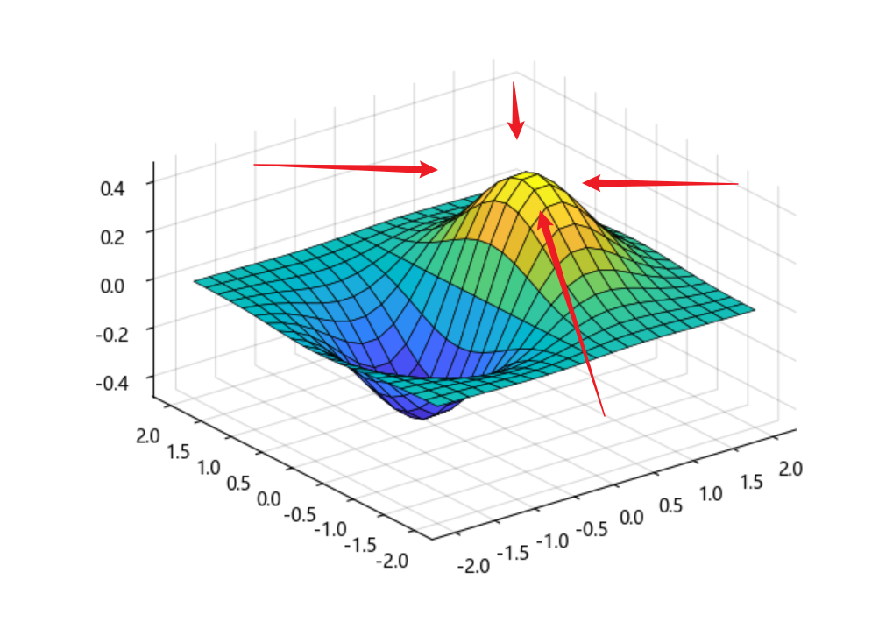
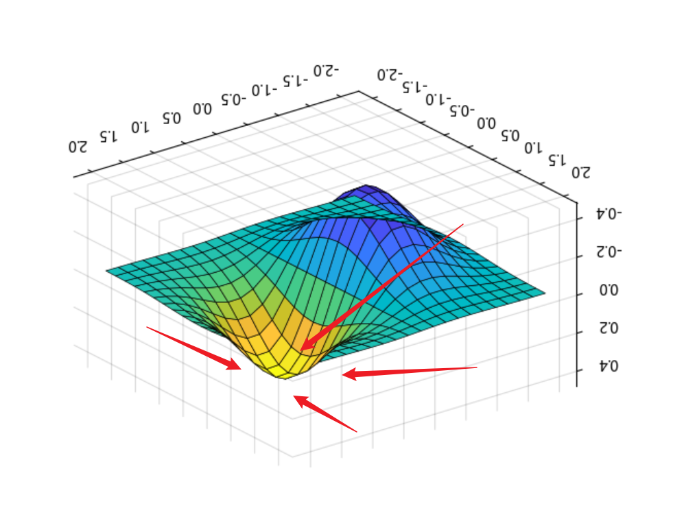

## 现代启发式算法

### 定义
“启发式算法”是相对于最优化方法提出的，其根本目的是找到某个问题的最优解。

启发式算法的定义之一是：一个基于直观或经验构造的算法，在可接受的花费（指计算时间和空间）下给出待解决组合优化问题每一个实例的一个可行解，该可行解与最优解的偏离程度一般不能被预计。

现阶段，启发式算法以仿自然体算法为主，主要有蚁群算法、模拟退火法、粒子群算法等。

### 为什么要学启发式算法

如果你学过《最优化方法》，老师会教你单纯形法、牛顿法、外点法梯度下降等方法，归根结底这些方法都是为了**找到某个函数的最低点** ，为实现这一点，我们往往需要用到导数，例如梯度在高维空间中，指向的是函数数值增长最快的方向。我们要找最低点，只需沿着梯度的反方向走（下坡）。

因为我们要求最小值，所以我们只需要在梯度之前加一个负号，就可以知道最低点在什么方向了。

求最小值是一个很基础但是可以被泛化的路径，因为现实世界中几乎所有问题，都可以被抽象为“让某个指标更好”。例如在商业中，我们需要让成本 $cost(x)$ 最小，并且让利润的负数 $-profit(x)$ 尽可能小。在物流领域中，我们希望让运输路径的总距离 $f(x)$ 最小。如果你研究过AI，那么你肯定知道深度学习的过程是让预测值和真实值的误差（Loss）$L(x)$ 最小。哪怕你有很多个目标，也可以通过某个指标（由其它指标的函数组合构成）的抽象，集其它目标之长，以大到最优、可接受的解。因此，你可以把优化这门学科视为“万物皆数”一般，建立起“万物皆可优化”的思维。

但是求最小值（或是说最优值）并不是一个容易的事情。当你建立起的函数是可以被求导的时候，用传统的优化方法当然可行；但现实世界，尤其是数学建模问题，往往比课本上的习题要复杂和脏得多。例如很多时候你的 $f(x)$ 无法被写为一个具体的函数，而是一个仿真结果；或是传统方法很容易陷入局部最优点，往任何方向走都是向上，但是真正的最低点还在几百单位之外；又或是问题是组合优化问题，例如去10个城市，怎么排序路径最短，这个时候传统的办法就不那么好用了。

总而言之，如果说《最优化方法》是如何在完美的F1地图上快速找到最低点，那么《启发式算法》就是教你如何在没有地图、地形复杂的荒野中，靠一群探险队员的协作找到一个足够安全且低的四号谷地。

### 文件顺序

1. 模拟退火
2. 遗传算法
3. 粒子群算法
4. 灰狼优化
5. 鲸鱼优化
6. 蚁群算法
7. 麻雀搜索算法

### 推荐资源

如果你没有学过最优化方法，并且对这门学科很感兴趣，可以去B站看[龙强老师的课](https://www.bilibili.com/video/BV1e64y1Y7Sr/)，他的[课件地址是这里](https://github.com/QiangLong2017/Optimization-Theory-and-Algorithm)。

吹水到此为止，请各位移步至特定的JupyterBook代码。